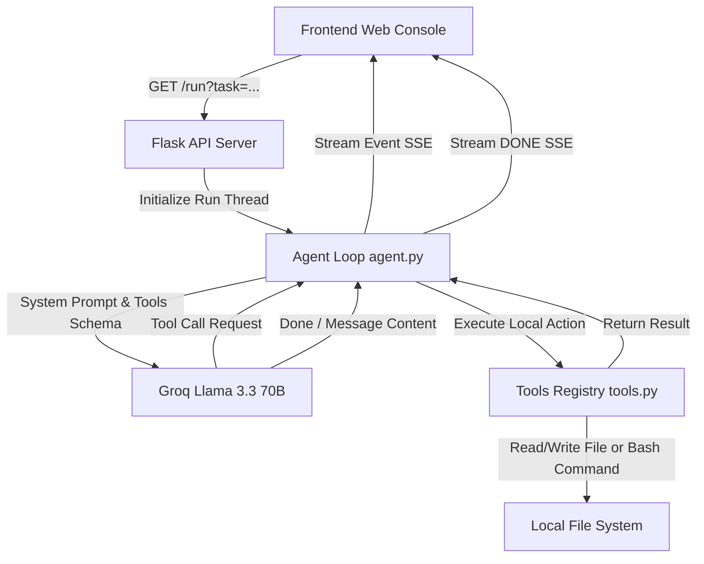

# Forge — Autonomous Dev Agent 🛠️✨

Forge is an elegant, lightweight, self-correcting autonomous development agent that translates natural language instructions into functional code and executable software. Powered by Groq's high-speed inference engine (`llama-3.3-70b-versatile`) and wrapped in a premium, minimalist web console, Forge runs locally to automate your coding workflows in real-time.

---

## 🏗️ Architecture & Technical Flow

Forge is built on a clean split-architecture: a Flask-based streaming backend orchestrates the LLM agentic loop, while a dynamic, aesthetic vanilla HTML5/CSS3 frontend displays real-time execution steps.



### 1. The Core Agent Loop (`agent.py`)
- **Engine**: Groq client calling `llama-3.3-70b-versatile`.
- **System Directive**: Directs the LLM to use discrete local actions (`read_file`, `write_file`, `run_bash`), execute them one at a time, check results, self-correct if errors occur, and iterate (up to 10 steps max per run).
- **Execution State**: Uses Python's `threading` and `queue.Queue` to run tasks asynchronously without blocking the web server.
- **Server-Sent Events (SSE)**: Streams agent status, tool calls, bash stdout/stderr, and completions dynamically to the frontend using the `/run` endpoint.

### 2. Tools Registry (`tools.py`)
- `read_file(path)`: Safely reads local files, returning descriptive errors if not found.
- `write_file(path, content)`: Automatically constructs directories recursively and writes content.
- `run_bash(command)`: Executes shell operations locally with a safety timeout of 15 seconds.
- `list_files(directory)`: Walks the workspace directory, automatically filtering out system folders (`venv`, `.git`, `__pycache__`).

### 3. Premium Web Interface (`frontend/index.html`)
- **Aesthetic**: Tailored CSS design with an immersive dark-to-light luxury canvas, organic floating particle animations via HTML5 Canvas, modern typography (Cormorant Garamond and DM Sans), and clean custom layouts.
- **Console Interface**: Interactive console detailing sequential steps with customized, color-coded execution states (Task, Tool Call, Result, Completed, Error, and live Thinking indicators).

---

## 🚀 Getting Started

### Prerequisites
- Python 3.10+
- A Groq API Key

### Installation
1. Clone the repository to your local machine.
2. Create and activate a Python virtual environment:
   ```bash
   python -m venv venv
   # On Windows:
   .\venv\Scripts\activate
   # On macOS/Linux:
   source venv/bin/activate
   ```
3. Install dependencies:
   ```bash
   pip install flask openai python-dotenv
   ```
4. Create a `.env` file in the root directory:
   ```env
   GROQ_API_KEY=your_groq_api_key_here
   ```
5. Launch the application:
   ```bash
   python agent.py
   ```
6. Open `http://localhost:8080` in your web browser.

---

